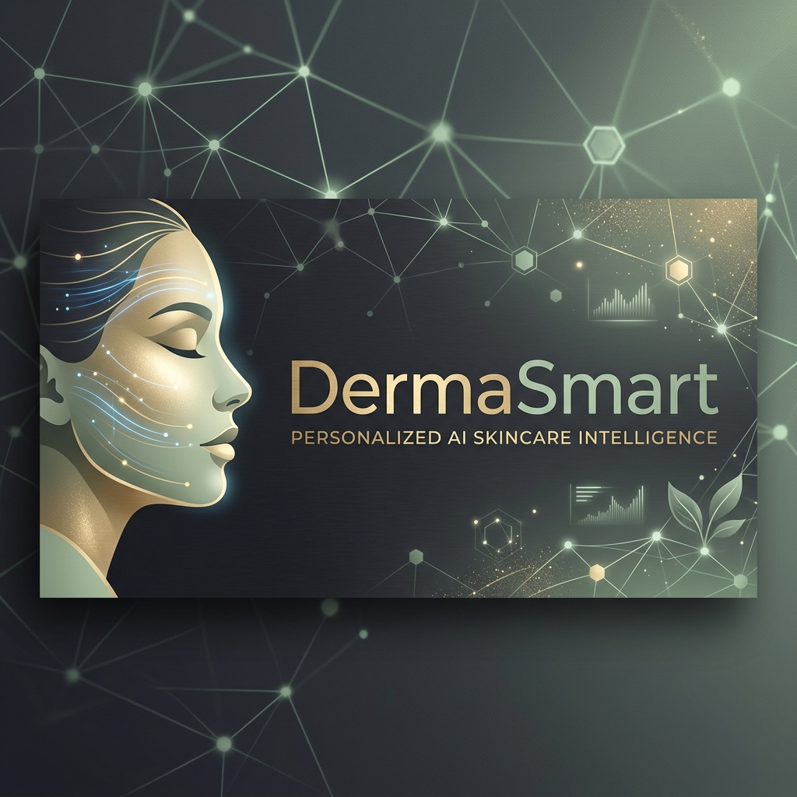

<div align="center">
  
  
  # 🌿 DermaSmart AI
  ### *Precision Dermatological Intelligence & Personalized Skincare Architecture*
  
  [](https://github.com/Ravikiranreddybada)
  [](https://github.com/Ravikiranreddybada)
  [](https://github.com/Ravikiranreddybada)

  [**View Demo Video**](https://www.loom.com/share/17b6ad752e344c5287185e778cc86020) • [**Explore Docs**](http://localhost:8000/docs)
</div>

---

## 💎 The Vision
**DermaSmart** is a professional-grade, "investor-ready" skin analysis platform that bridges the gap between raw computer vision and personalized dermatological care. By combining a custom-trained **MobileNetV2** classification engine with the reasoning power of **Google Gemini 2.0**, DermaSmart provides clinical-grade reporting with a premium, high-end user experience.

---

## 🚀 Advanced Engine Features (The Technical Flex)

### 1. 🛡️ Ethical AI & Medical Safeguards
Unlike generic AI tools, DermaSmart treats medical safety as a first-class citizen.
- **Emergency Override**: If the TensorFlow model detects a high probability of malignant lesions (e.g., Melanoma, Basal Cell Carcinoma), the system **hard-intercepts** the request.
- **Gemini Detachment**: To prevent "hallucinated" cosmetic advice for cancer, the LLM is completely bypassed for critical conditions, triggering a high-visibility **Medical Alert UI** instead.

### 2. 🔐 Privacy-First "In-Memory" Pipeline
Built for PII (Personally Identifiable Information) compliance.
- **Volatile Processing**: User photos are never written to physical disk storage.
- **Byte-Stream Architecture**: Images are processed as raw byte-arrays in the server's RAM and purged instantly upon response delivery, ensuring no facial data persists on the server.

### 3. 🔍 Neural Image Gating (Data Quality)
To solve the "Garbage In, Garbage Out" problem, every upload passes a 3-stage audit:
- **Face Detection**: Uses OpenCV Haarcascades to mathematically verify human presence.
- **HSV Segmentation**: A color-space fallback to ensure the subject is human skin, not an inanimate object.
- **Confidence Thresholding**: A strict `< 50%` reject-gate ensures the AI only speaks when it is certain.

### 4. 🔄 RLHF Feedback Loop
- **Human-in-the-Loop**: Users can provide "Ground-Truth" feedback on the AI's accuracy via an interactive dashboard widget.
- **Data Moat**: All feedback is logged to MongoDB, creating a high-value dataset for future model fine-tuning and fine-grained accuracy improvements.

---

## 🛠️ Technology Stack

| Layer | Technologies |
| :--- | :--- |
| **Frontend** | React 18, TypeScript, Vite, Framer Motion, Radix UI, TailwindCSS |
| **Intelligence** | TensorFlow (Custom MobileNetV2), Google Gemini 2.0 Flash, OpenCV |
| **Backend** | FastAPI, Python 3.12+, Uvicorn, Motor (Async MongoDB) |
| **Database** | MongoDB Atlas (Cloud Persistence) |

---

## 📦 Quick Start

### 1. Prerequisites
- **Python**: 3.9+ (Miniforge recommended for Mac M-series)
- **Node.js**: 18+
- **MongoDB**: Atlas Cluster (v4.0+)

### 2. Launch the Ecosystem
We provide pre-configured scripts for the fastest deployment possible:

```bash
# Terminal A — Launch the AI Microservice
./start-backend.sh

# Terminal B — Launch the Premium Dashboard
./start-frontend.sh
```

---

## 📂 Project Structure
```text
├── backend/            # FastAPI microservice & ML integration
├── frontend/           # React dashboard & UI components
├── model/              # Custom TensorFlow training notebooks
└── assets/             # Branding & Project Visuals
```

---

## ⚖️ Medical Disclaimer
**DermaSmart is an AI-powered cosmetic evaluation tool and does not provide medical advice.** The results generated by our models are for informational purposes only and are not a substitute for professional medical diagnosis or treatment. Always consult a certified dermatologist for any skin concerns.

---

<div align="center">
  <p><b>Designed & Engineered with ❤️ by <a href="https://github.com/Ravikiranreddybada">Ravi Kiran Reddy Bada</a></b></p>
  <p><i>Building the future of personalized dermatological intelligence.</i></p>
</div>
