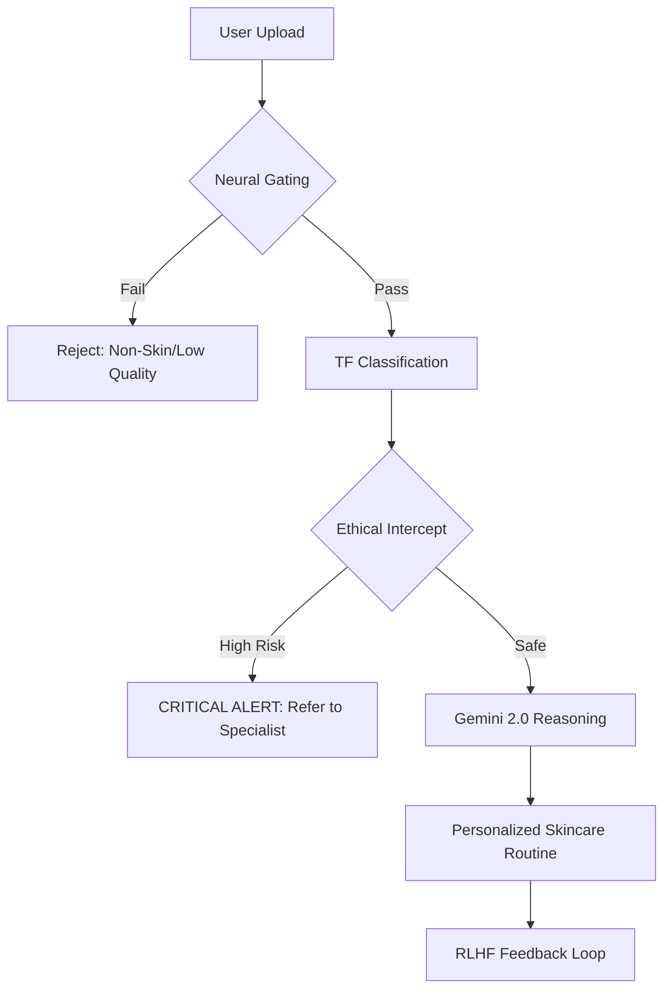

# 🌿 DermaSmart: AI-Powered Dermatological Intelligence

### *Precision Skin Analysis, Ethical Safeguards, and Personalized Care Architecture*

<div align="center">

[](https://opensource.org/licenses/MIT)
[](https://fastapi.tiangolo.com/)
[](https://reactjs.org/)
[](https://www.tensorflow.org/)
[](https://www.mongodb.com/atlas)

[**Live Application**](https://dermasmart.vercel.app) • [**API Reference**](https://dermasmart.onrender.com/docs) • [**Video Demo**](https://www.loom.com/share/17b6ad752e344c5287185e778cc86020)

</div>

---

## 📖 Overview

**DermaSmart** is a professional-grade skin analysis platform designed to bridge the gap between AI-driven computer vision and personalized dermatological health. It utilizes a hybrid intelligence engine—combining deep learning classification with LLM-based reasoning—to provide clinical-grade insights while prioritizing user safety and data privacy.

### The Problem
Skin conditions affect millions, yet access to immediate specialized dermatological care is often limited. Generic "photo-search" tools lack the medical reasoning and safety safeguards required for health-critical assessments.

### The Solution
DermaSmart implements a multi-stage **"Safe-Audit" Pipeline**. It doesn't just classify an image; it verifies image quality, checks for high-risk malignant indicators, and uses Google Gemini 2.0 to provide nuanced, personalized routine suggestions backed by classification data.

---

## 🏗️ Core Architecture: The Intelligence Pipeline

DermaSmart operates through a sophisticated 4-layered audit system to ensure maximum precision and safety:



1.  **Neural Image Gating (OpenCV)**: Mathematically verifies human presence and skin texture using HSV segmentation and Haar cascades to prevent "garbage-in/garbage-out" errors.
2.  **Deep Learning Classification**: A custom-trained **MobileNetV2** (or EfficientNetV2) engine identifies 9+ skin conditions with high-confidence thresholds.
3.  **Ethical "Hard-Intercept"**: If the model detects high probabilities of malignant lesions (e.g., Melanoma), the system **bypasses LLM reasoning** and triggers an immediate medical alert UI to prevent misinformed advice.
4.  **Generative Reasoning**: Google Gemini 2.0 Flash synthesizes the classification results and user-specific data to generate a tailored morning/evening routine.

---

## 🚀 Key Features

*   **🛡️ Ethical Safeguards**: Automatic detection and interception of critical conditions for immediate professional referral.
*   **🔐 Privacy-First Design**: "In-Memory" processing ensures user photos are never persisted to disk storage, only processed in volatile RAM.
*   **🔍 High-Precision Gating**: Multi-stage pre-processing audit ensures the AI only analyzes valid, high-quality skin images.
*   **🔄 RLHF Feedback Loop**: Interactive dashboard allowing users to provide "Ground-Truth" feedback, creating a proprietary dataset for continuous model improvement.
*   **✨ Premium UI/UX**: Built with Framer Motion and Radix UI for a fluid, high-end dashboard experience.

---

## 🛠️ Tech Stack

| Category | Technologies |
| :--- | :--- |
| **Frontend** | React 18, TypeScript, Vite, Framer Motion, TailwindCSS, Shadcn/UI |
| **Backend** | FastAPI (Python 3.12), Uvicorn, Motor (Async MongoDB Driver) |
| **AI/ML** | TensorFlow, Keras, OpenCV, Google Gemini 2.0 Flash |
| **Auth & Security** | Auth0 (OIDC), JWT, In-Memory Byte-Stream Processing |
| **Database** | MongoDB Atlas (Cloud Persistence) |

---

## 📂 Project Structure

```text
├── backend/            # FastAPI Microservice & ML Business Logic
│   ├── aiModel.py      # TF Model loading & inference
│   ├── gemini.py       # LLM Reasoning & routine generation
│   ├── routes/         # API Endpoints (Auth, Analysis, Profile)
│   └── requirements.txt
├── frontend/           # React Dashboard & Real-time Camera Integration
│   ├── src/components/ # Reusable Radix/Shadcn UI components
│   ├── src/pages/      # Analysis, Dashboard, and User Profile pages
│   └── vite.config.ts
├── model/              # ML Research & Training Notebooks
└── README.md           # The ultimate project documentation
```

---

## 📦 Installation & Setup

### 1. Prerequisites
- **Python**: 3.10+
- **Node.js**: 18+
- **MongoDB**: Atlas Cluster (v4.0+)

### 2. Environment Configuration
Create a `.env` file in both `backend/` and `frontend/` directories (see `.env.example` in respective folders).

### 3. Launch the Ecosystem

**Frontend Setup:**
```bash
cd frontend
npm install
npm run dev
```

**Backend Setup:**
```bash
cd backend
python -m venv venv
source venv/bin/activate # Windows: .\venv\Scripts\activate
pip install -r requirements.txt
python main.py
```

---

## 🔮 Future Improvements

- [ ] **TFLite Integration**: Transitioning classification to client-side (Edge AI) for zero-latency gating.
- [ ] **Video Analysis**: Real-time skin scanning via streaming video.
- [ ] **Community Portal**: Secure, anonymous condition tracking and community support.
- [ ] **Wearable Integration**: Syncing skin hydration levels from IoT devices.

---

## 🤝 Contributing

Contributions are what make the open-source community such an amazing place to learn, inspire, and create. Any contributions you make are **greatly appreciated**.

1. Fork the Project
2. Create your Feature Branch (`git checkout -b feature/AmazingFeature`)
3. Commit your Changes (`git commit -m 'Add some AmazingFeature'`)
4. Push to the Branch (`git push origin feature/AmazingFeature`)
5. Open a Pull Request

---

## ⚖️ License & Disclaimer

**License**: Distributed under the MIT License. See `LICENSE` for more information.

**Medical Disclaimer**: DermaSmart is an AI-powered educational tool and **does not provide medical advice**. Results are informational and not a substitute for professional diagnosis. Always consult a certified dermatologist for skin concerns.

---

<div align="center">

**Developed with ❤️ by [Ravi Kiran Reddy Bada](https://github.com/Ravikiranreddybada)**
*Building the future of personalized dermatological intelligence.*

</div>
